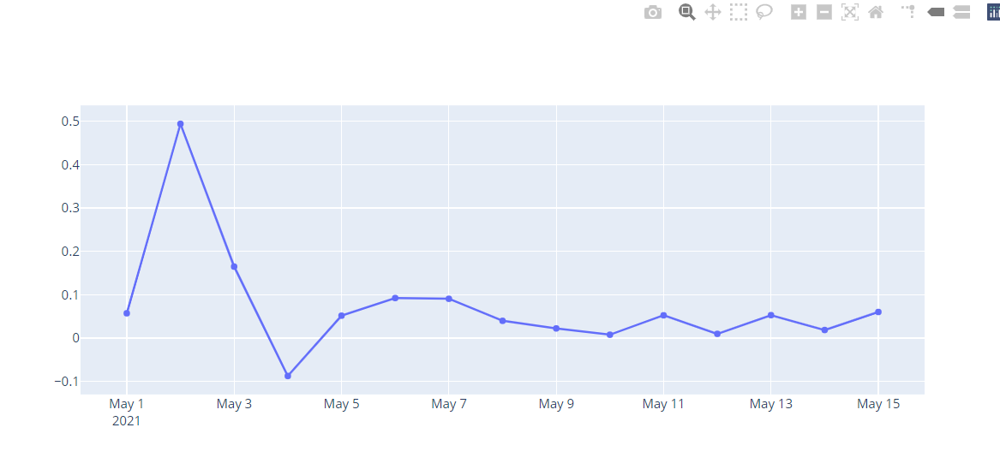
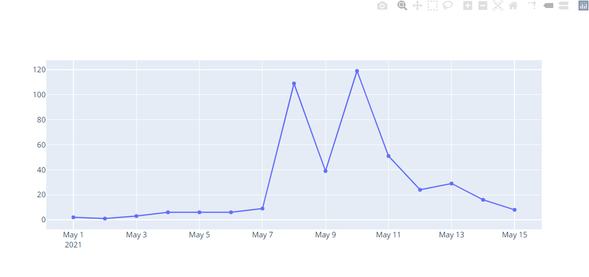

Used `spacy` to detect language.

Used `nltk` to tokenize the messages.

Sentiment score is a score between -1 and 1. The closer the number is to one, it is more positive and vice versa.

Average sentiment score per day:

Number of messages per day:
